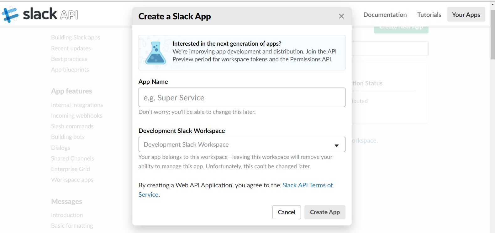

# Fn Slack Bot

Fn functions to implement a simple [Slack Bot](https://api.slack.com/bot-users)

## step 0

- `git clone https://github.com/abhirockzz/fn-slack-bot-sample`
- make sure you have Fn installed on an infra which can be accessed from public internet (e.g. VM), or use [ngrok](https://api.slack.com/tutorials/tunneling-with-ngrok) on your local machine

## Handle slack verification challenge function

Start Fn server - `fn start`

From a different terminal, configure Docker

- `docker login` (use your docker registry credentials)
- `export FN_REGISTRY=<docker repository>`

deploy the function to respond to slack verification challenge

- `cd slack-verification-challenge-handler`
- `fn -v deploy --app fnbot`

> the public URL for the function should be `http://your_ip:port/r/fnbot/service` (`fnbot` is the app name which `service` is the path)

## Slack config

Sign into your [Slack workspace](https://slack.com/signin) - if you don't have one, [please create it](https://slack.com/create)

Before you start, you'll need a Slack App - [click here](https://api.slack.com/apps/new) to get started

To use your Slack App as a bot, first you'll need to create a Bot User for it - refer to section **1. Creating a bot user** on [this page](https://api.slack.com/bot-users)

Setup the Events API for your bot. Refer to section **2. Setting up the Events API** on [this page](https://api.slack.com/bot-users)

- In the Request URL, enter your function endpoint (as mentioned above)

- Subscribe to the `app_mention` Bot Event (the Fn bot function is designed to handle this event)

For the next steps, refer section **3. Installing the bot to a workspace** on [this page](https://api.slack.com/bot-users)

- Install the bot to your workspace

- Store the **Bot User OAuth Access Token** for later use 

- from the **Basic Information** section in your app settings page, scroll down and make a note of the verification token

## Deploy the bot function

- `cd slack-app-mention-event-handler`
- update the `SLACK_VERIFICATION_TOKEN` and `SLACK_BOT_OAUTH_TOKEN` in the `config` section in `func.yaml` with the values you saved in the previous step
- deploy the function - `fn -v deploy --app fnbot`. Note that this will override the challenge verification function because
	- challenge verification is a `one-time` process and 
	- once you configure the request URL, Slack will send all your subscribed events to the same endpoint/URL i.e. you cannot change it

## Have fun with Fn Bot !

The bot itself is super simple (a.k.a dumb). It responds to your mention by returning a message with the current date - not ground breaking, but it works!

Head over to your Slack workspace and simple mention your bot (by its name) e.g. `@testbot`

I told you, it's dumb.. no matter what you throw at it !

## Fn Concepts

TODO details

- uses `async` function
- simple JSON to POJO data bindings
